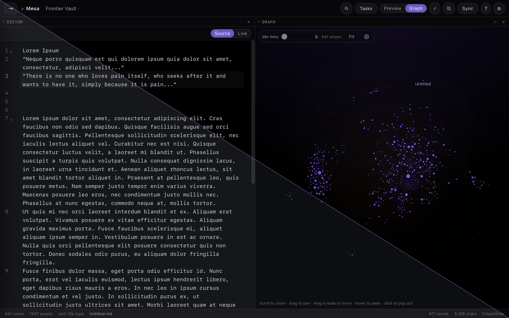
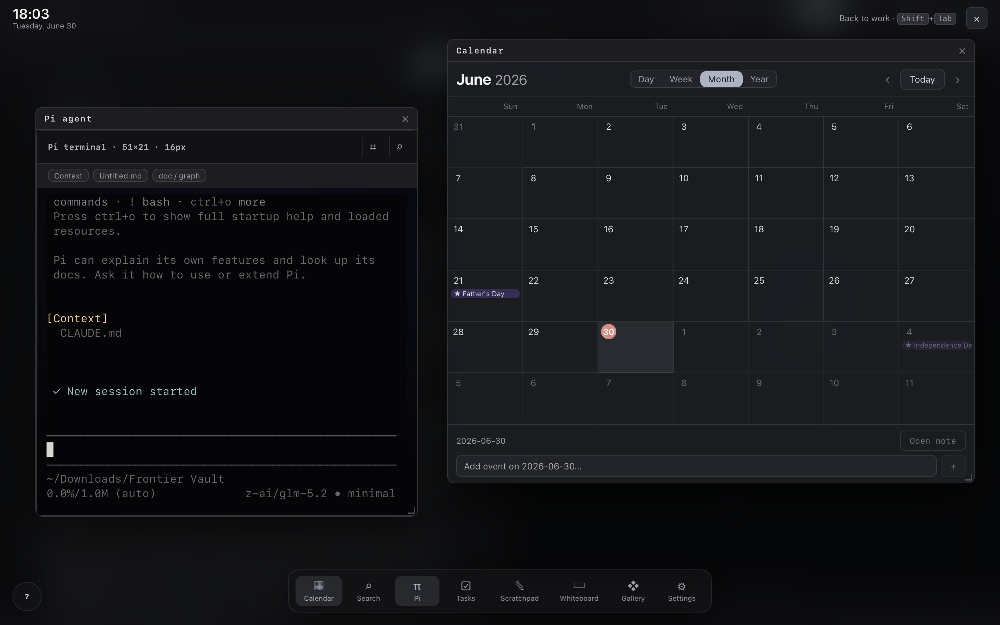

<div align="center">

# Mesa

### A local-first note vault with a living, force-directed graph

Your notes are plain Markdown in a folder you choose — never moved, never locked,
never uploaded. Mesa adds a fast editor, a graph that comes alive as your files
change, inline viewers for every common file type, and peer-to-peer sync across
your own devices.

<br>


<br>



</div>

---

## Why Mesa

Plenty of tools store notes as Markdown. Mesa is for people who want their vault
to *do* something. Local-first, plain-Markdown storage is the baseline here — not
the pitch. What sets Mesa apart is everything built on top of it:

- **A built-in agent, not a plugin.** Mesa ships **Pi**, a lightweight agent
  harness that launches the real `pi` CLI in an embedded terminal. It sees only
  what you're actively looking at — the current vault and open files — and never
  calls a model in the background. One shortcut and your notes have a
  context-aware assistant, with a hard boundary around what leaves your machine.
- **Actually open *anything*.** Most vaults render Markdown and stop. Mesa opens
  PDFs (view **and** annotate), saved HTML pages, RTF, images, and video inline
  in the main pane — so your vault holds your whole working set, not just text.
- **A graph that reacts in real time.** The force-directed graph isn't a static
  map. Nodes pulse the moment a file is read, edited, written, or created —
  *including by external tools* — so you can watch your vault change as it
  happens, with a floating card narrating each event.
- **Planning built in.** A tasks dashboard, daily notes, a calendar, and
  templates live inside the app, so capturing and scheduling work never means
  leaving your notes for another tool.
- **A real desktop app.** Mesa runs on the OS-native webview via Tauri instead of
  bundling a browser engine — so it starts fast, stays small, and ships as signed
  macOS (universal), Windows, and Linux builds.

Your files still stay yours — plain `.md` in a folder you choose, no cloud, no
lock-in. That's the floor Mesa is built on, not the ceiling.

## Highlights

- **Plain-Markdown vault** — Point Mesa at any folder. New notes are saved there
  as `.md`. Nothing proprietary; your files stay yours.
- **Living graph** — A canvas force-graph where nodes are notes, sized by link
  degree. Nodes flicker when their file is read, edited, written, or created —
  even by external tools — and a floating card shows what's happening.
- **A real editor** — CodeMirror 6 with live Markdown preview, `[[wiki-links]]`,
  backlinks, tags, tabs, autosave, and a command palette (`⌘P`).
- **Open anything inline** — Markdown, images, video, PDF (view + annotate), RTF,
  and HTML all render in the main pane.
- **Fast search** — Search by name and content with filetype filters
  (`ext:pdf`, `type:md`).
- **Stay organized** — A tasks dashboard, daily notes, calendar, and templates.
- **Device sync** — LocalSend-style pairing over LAN / Tailscale. Token-authed,
  no cloud.
- **Curated themes** — Several fully-tokenized themes for a coherent look.

## Tech stack

Tauri 2 (Rust shell + system webview) · React 18 + TypeScript · Vite · Zustand ·
CodeMirror 6 · markdown-it · d3-force (canvas) · pdf.js + pdf-lib (lazy) · fflate
(zip) · Vitest.

Mesa uses the operating system's native webview instead of bundling a browser
engine, so the app stays small and starts fast.

## Quick start (from zero)

Clean machine — no Node, no Rust, no build tools? **One command.** It clones
Mesa and hands off to the setup script for your OS ([`run.sh`](run.sh) /
[`run.cmd`](run.cmd)), which installs every missing dependency (system build
libraries, Node.js LTS, Rust) into your user account, then launches the app.
Nothing to install by hand, no back-and-forth.

**macOS / Linux** — paste into a terminal:

```bash
curl -fsSL https://raw.githubusercontent.com/xobash/xo-mesa/main/install.sh | bash
```

**Windows 10 / 11** — paste into a normal (non-admin) PowerShell window:

```powershell
irm https://raw.githubusercontent.com/xobash/xo-mesa/main/install.ps1 | iex
```

That's it — the first launch compiles the Rust shell (a few minutes), then the
window opens on its own. The setup scripts are safe to re-run: they skip
anything already installed and simply relaunch.

<details>
<summary>What the setup script installs, and how to read it first</summary>

All three bootstrap scripts are short and readable — open [`install.sh`](install.sh),
[`run.sh`](run.sh), or [`run.cmd`](run.cmd) before running if you prefer. They
install only what's missing:

- **macOS** — `install.sh` reuses the current `xo-mesa` checkout when you're
  already inside one, otherwise clones it, then hands off to `run.sh`. The
  first run installs Xcode Command Line Tools (C compiler + git), Rust via
  `rustup` (user-only), and Node.js LTS via `nvm` (user-only). `npm run
  mesa:build` produces a signed universal (`aarch64` + `x86_64`) `.app`.
- **Linux** — `install.sh` can install Git first via `apt`/`pacman`/`dnf`, then
  clones or fast-forwards Mesa and hands off to `run.sh`. `run.sh` installs
  WebKitGTK 4.1 + build toolchain via your package manager (the one step that
  uses `sudo`), Rust via `rustup`, and Node.js LTS via `nvm`. `npm run
  mesa:build` produces AppImage / deb / rpm.
- **Windows** — Node.js LTS, Rust, and Git via Scoop when available, with
  `winget` fallbacks for locked-down PowerShell environments. The script
  verifies `cargo` and the Microsoft C++ Build Tools before launch, so a failed
  dependency install stops with a fix message instead of failing inside Tauri.
  WebView2 runtime also uses `winget` when available.
  `npm run mesa:build` produces `.msi` + `.exe` installers.

Everything lands in your user account (`~/.cargo`, `~/.rustup`, `~/.nvm`,
`%USERPROFILE%\scoop`, and this project's `./node_modules`) — no global system
changes beyond the Linux system libraries and the Windows build tools.

</details>

> **Prefer the old local-clone flow on macOS/Linux?** It still works:
> `git clone https://github.com/xobash/xo-mesa.git && cd xo-mesa && bash run.sh`.
> The new `install.sh` path just makes the first-run command match the Windows
> bootstrap shape and handles clone/update for you.

**Optional — turn on the Pi agent.** Mesa's built-in agent runs the real `pi`
CLI, so install it once and authenticate:

```bash
npm install -g @mariozechner/pi-coding-agent
pi        # then run /login (or set an API key like ANTHROPIC_API_KEY) once
```

Mesa finds `pi` on your `PATH` automatically; if you keep it somewhere custom,
point `MESA_PI_BIN` at the executable.

## Getting started

Already have Node and Rust? The short path:

**Prerequisites:** Node 18+, and [Rust](https://rustup.rs) for the desktop build.

```bash
# install dependencies
npm install

# run the desktop app (compiles the Rust shell on first run)
npm run mesa

# or run a browser-only preview with a demo vault (no Rust required)
npm run dev
```

### Build

```bash
npm run build         # type-check + bundle the web assets
npm run mesa:build    # package the desktop app (macOS / Windows / Linux)
```

### Test & type-check

```bash
npm test              # Vitest unit tests
npm run typecheck     # strict TypeScript, no emit
```

## The overlay, Pi, and keyboard shortcuts

Mesa has a second surface that sits *on top of* your vault: a Steam-style
overlay you summon with a single key. Press **Shift+Tab** and a full-screen work
layer fades in over the graph, with a dock — **Calendar**, **Search**, **Pi**,
**Tasks**, **Scratchpad**, **Whiteboard**, **Gallery**, **Settings** — that
opens draggable, resizable windows, all live, all over the same vault. It's
built for the moment you want to plan or ask Pi something without losing your
place in what you were reading.



**Pi** is Mesa's built-in agent (see [docs/pi-agent.md](docs/pi-agent.md)). It
launches the real `pi` CLI in an embedded PTY — not a fake chat box — starting
in your vault folder with only your *directly accessed* context injected (vault
path, the active file, open files, and the current layout). It never calls a
model in the background, and it never uploads your file list or file contents;
you or your prompt decide what's worth spending tokens on. When Pi reads or
writes a note, the graph reacts in real time: the node flickers and a live
preview card narrates the operation. That works for **reads as well as writes**,
across every model and provider Pi can drive, because Mesa hooks Pi's own
tool-execution pipeline over a loopback-only bridge — nothing leaves the machine.

You can pop Pi into its own OS window and dock it back, place it in the main
workspace, or float it from the overlay; Mesa keeps a single shared Pi session
across all three so switching surfaces reattaches the same process instead of
spawning a new one.

### Keyboard shortcuts

| Shortcut | Action |
|---|---|
| `Shift+Tab` | Toggle the Steam-style overlay |
| `Cmd/Ctrl + Shift + Space` | Toggle the floating Pi window (works globally, even when Mesa isn't focused) |
| `Cmd/Ctrl + P` | Command palette |
| `Cmd/Ctrl + Shift + F` | Search (name + content, with `ext:` / `type:` filters) |
| `Cmd/Ctrl + N` | New note |
| `Cmd/Ctrl + ,` | Settings |
| `Cmd/Ctrl + W`, then `h`/`l` · `H`/`L` · `j`/`k` · `f` · `q` | Window commands: focus / move / reorder panes, flip the dock side, close a pane |
| `g g` / `Shift+G` | Jump to the first / last file |
| `j` / `k` | Move through the file list and panes |
| `Esc` | Close the overlay or the current modal |

Inside the Pi terminal:

| Shortcut | Action |
|---|---|
| `Ctrl + Shift + Tab` / `Alt + Shift + Tab` / `Shift + F2` | Cycle Pi's reasoning level (Mesa owns plain `Shift+Tab` for the overlay, so it synthesizes the sequence Pi expects) |
| `Ctrl + =` / `Ctrl + -` / `Ctrl + 0` | Grow / shrink / reset the terminal font |

Shortcuts stand down while you're typing in an editor or input, so they never
fight normal text entry.

## Sync — your devices, your network, your key

Mesa's sync is peer-to-peer between *your own* devices. There is no Mesa server
in the middle and no account: pairing is LocalSend-style, and every request to
the embedded server must carry your **sync key** as a bearer token, so nobody
else on the network can read or write your vault. Full details live in
[docs/sync.md](docs/sync.md); the shape of it:

- **LAN, Tailscale, or an explicit HTTP(S) endpoint.** Bare addresses default to
  plain `http://` — the normal LAN/Tailscale path — while explicit `http://` and
  `https://` addresses are preserved. A *Prefer HTTPS for bare addresses* toggle
  is there for anyone fronting a peer with TLS.
- **Tailscale works with zero extra setup.** Because Mesa talks directly to a
  peer's address, a Tailscale IP or MagicDNS name syncs your vault securely
  across networks without exposing anything to the public internet — your
  tailnet *is* the transport.
- **Discovery is metadata-only.** While the Sync menu is open (or you're
  listening), Mesa announces just device name, LAN address, port, and listening
  status. It never broadcasts the vault path, the sync key, or any file content.
- **One hard off switch.** *Sync and discovery* is a master override: off means
  Mesa stops listening, stops LAN discovery, blocks manual sync, and suppresses
  scheduled sync even if you have saved peers.
- **Scheduled + health-aware.** Set a minute interval to sync saved peers while
  Mesa is open (`0` keeps it manual). Each peer records last-synced time, last
  check, a health state (healthy / error / unknown), and the last error.
- **Non-destructive by design.** A file changed on two devices is saved as a
  conflict copy, never silently overwritten. Content hashing (FNV-1a/64) means
  only changed files move across the wire.

## Security & safety model

Mesa's guiding rule is that your vault stays on your machine, and nothing leaves
it unless you send it there. The design draws a small number of hard boundaries
rather than relying on settings you have to remember to turn on.

**Local-first, no telemetry.** Mesa does not phone home. There is no analytics
SDK, no crash-reporting beacon, no account, and no Mesa-operated server. The only
network traffic Mesa originates is (a) peer-to-peer sync to devices you pair with
and (b) whatever the Pi agent sends to *your* configured model provider when you
prompt it. Everything else is reads and writes to the folder you chose.

**Filesystem scope.** The Tauri shell talks to the OS through a narrow,
explicit command surface rather than exposing a general filesystem API to the
web layer. The app works against the vault folder you pick; it does not scan or
index the rest of your disk.

**The Pi agent has a hard boundary.** Pi runs the genuine `pi` CLI in an
embedded terminal scoped to your vault. It never calls a model in the background
— it acts only when you prompt it — and it never uploads your file list or file
contents on its own. Only your *directly accessed* context (vault path, active
file, open files, current layout) is injected; you decide what's worth sending.
The bridge that lets Pi's reads and writes animate the graph is **loopback-only**
(`127.0.0.1`) and token-authed, so that activity feed never crosses the network.
Pi talks to whatever provider you authenticate it with — that traffic is between
you and that provider, on your key.

**Sync is authenticated and yours.** Every request to the embedded sync server
must carry your **sync key** as a bearer token, so nobody else on your network
can read or write your vault. Discovery announces metadata only (device name,
LAN address, port, listening status) — never the vault path, the key, or file
contents. A single master *Sync and discovery* switch turns all of it off. Sync
is non-destructive: a file changed on two devices becomes a conflict copy, never
a silent overwrite. See [docs/sync.md](docs/sync.md) for the full model.

**Supply-chain hygiene.** Mesa is deliberately small and easy to vet:

- **A native webview, not a bundled browser.** Because Mesa uses the OS webview
  via Tauri instead of shipping Electron/Chromium, its dependency surface is a
  few hundred KB of Rust glue plus a short, mainstream JS runtime list — far
  less third-party code to trust than an Electron app.
- **Pinned and lockfile-committed.** `package-lock.json` and `Cargo.lock` pin
  exact versions and integrity hashes, so a build reproduces the same tree and a
  swapped-out package upstream can't silently slip in.
- **Unaffected by the recent npm attacks.** Mesa's tree was checked against the
  2025–2026 npm supply-chain incidents — the *qix* `chalk`/`debug`/`ansi-styles`
  compromise (Sept 2025) and the self-replicating **Shai-Hulud** worm and its
  variants that poisoned hundreds of packages including `@ctrl/tinycolor`. None
  of the compromised packages or versions are present; Mesa's `debug` resolves to
  `4.4.3`, which is *after* the malicious `4.4.2`.
- **Runtime deps ship; dev tooling doesn't.** The only advisories `npm audit`
  reports are known dev-server issues in the build toolchain (`vite` / `vitest` /
  `esbuild`). These run only on a developer's machine during `npm run dev`/tests
  and are **not** part of the packaged desktop app, so they don't affect
  installed Mesa. They are non-malware advisories, not compromised packages.

You can reproduce the check yourself: `npm ci` for an exact install, then
`npm audit` and `npm ls debug` to confirm the tree.

**Reporting.** Found a security issue? Please open a private report on the
[GitHub repository](https://github.com/xobash/xo-mesa) rather than a public issue.

## How Mesa differs from Obsidian — and from other open-source clones

Plenty of tools store notes as Markdown in a folder, and several open-source
projects clone the Obsidian *look*. Mesa starts from the same local-first,
plain-`.md` floor and then diverges on purpose. The difference isn't the storage
format — it's that Mesa's vault is meant to **do something and react to what's
happening to it**.

- **The graph is alive, not a map.** Obsidian's graph (and every clone's) is a
  static diagram you occasionally open. Mesa's force-directed graph breathes at
  idle and, more importantly, **reacts the instant a file is read, edited,
  written, or created — including by external tools and agents** — with a
  node flicker and a floating card narrating the event. Watching your vault
  change as it happens is the headline feature, not a novelty tab.
- **A real agent is built in, with a hard token boundary.** Pi isn't a plugin
  bolted on later; it's a first-class surface running the genuine `pi` CLI in an
  embedded terminal, scoped to only what you're actively looking at, that never
  calls a model in the background. Crucially, Pi's activity feeds the living
  graph in both directions — reads *and* writes — across any model or provider,
  which no Markdown vault does.
- **It opens your whole working set, not just Markdown.** Most vaults render
  `.md` and stop. Mesa views **and annotates** PDFs, renders saved HTML pages,
  RTF, images, and video inline in the main pane — so the vault holds the real
  material you work against, not just text about it.
- **Planning lives inside the notes.** A tasks dashboard (with a kanban view),
  daily notes, an Apple-Calendar-style calendar, and templates are part of the
  app and the overlay, so capturing and scheduling never means leaving for
  another tool.
- **It's a real native app, not a bundled browser.** Mesa runs on the OS-native
  webview via Tauri instead of shipping an Electron/Chromium engine, so it starts
  fast, stays small (a few hundred KB of Rust glue, no bundled browser), and
  ships as signed macOS (universal), Windows, and Linux builds. Many "Obsidian
  clones" are Electron apps; Mesa is deliberately not.
- **Sync is peer-to-peer and yours.** No account, no Mesa server, no cloud — just
  your devices, your network (LAN or Tailscale), and your key, with
  non-destructive conflict handling.

The floor — plain `.md` in a folder you choose, no lock-in — is the same promise
Obsidian makes. Everything above it is where Mesa goes its own way.

## Project layout

```
src/                 React + TypeScript front-end
  components/        UI (editor, graph, sidebar, viewers, modals, panels)
  lib/               pure logic (vault, graph, markdown, search, sort, pdf, …)
  store.ts           Zustand app state
  styles.css         all styling + theme tokens
src-tauri/           Rust shell (filesystem, dialogs, Pi PTY, sync + activity servers)
docs/                feature documentation
```

## Privacy

Mesa is local-first. It does not phone home. Sync only talks to devices you pair
with, over your own network, behind your sync key.

## License

Released under the [MIT License](LICENSE).
