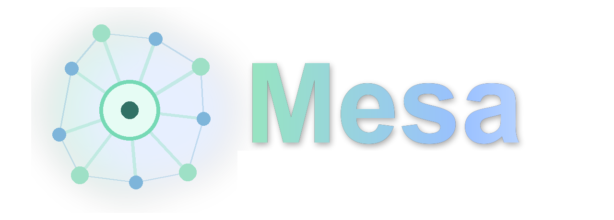
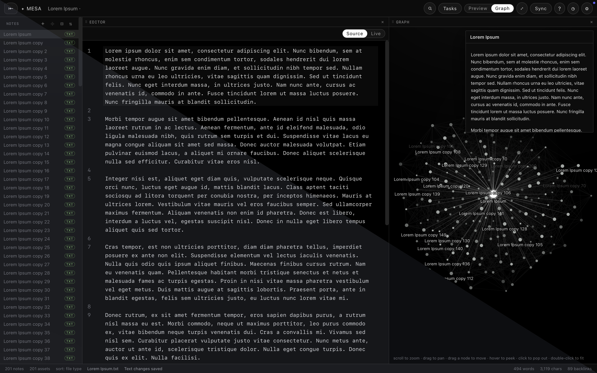
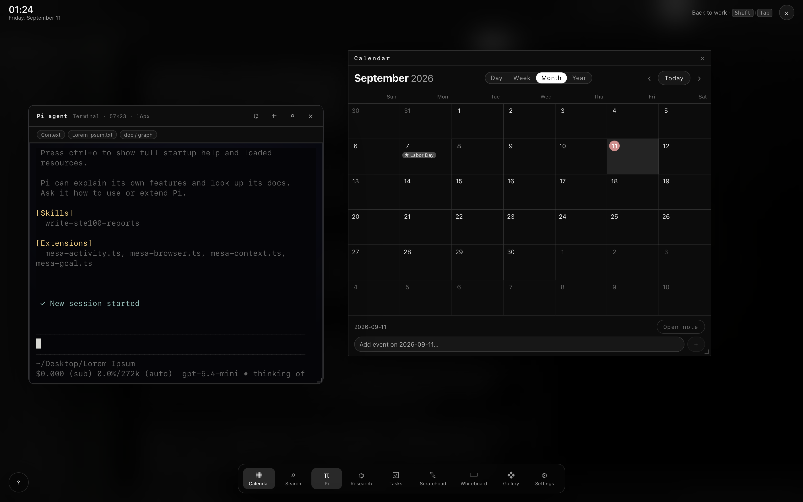

<p align="center">
  
</p>

<p align="center">
  <strong>A local desktop workspace for research, documents, tools, and action.</strong><br />
  <a href="#quick-start">Quick Start</a>&nbsp;·&nbsp;<a href="#features">Features</a>&nbsp;·&nbsp;<a href="#local-first-guarantees">Local-first</a>&nbsp;·&nbsp;<a href="#requirements">Requirements</a>&nbsp;·&nbsp;<a href="#development">Development</a>&nbsp;·&nbsp;<a href="#contributing">Contributing</a>
</p>

<p align="center">
  
  
  
</p>

## What Is Mesa?

Mesa is a local-first desktop workspace built around a normal folder on your
computer. It combines notes, documents, research, tasks, terminal tools, and a
living graph. Your files stay portable and under your control. Mesa does not
require an account or a hosted cloud service.

<p align="center">
  
</p>

---

## Quick Start

Each installer creates or updates a Mesa checkout, installs missing
requirements, and starts Mesa.

> The first start builds the desktop shell. This step can take several minutes
> on a new machine.

### macOS and Linux

```bash
curl -fsSL https://raw.githubusercontent.com/xobash/xo-mesa/main/install.sh | bash
```

The installer clones a new checkout or fast-forward updates an existing one.
It installs missing prerequisites and starts Mesa.

### Windows 10 and Windows 11

```powershell
irm https://raw.githubusercontent.com/xobash/xo-mesa/main/install.ps1 | iex
```

The Windows installer keeps local source changes. It stops before an unresolved
restore conflict can overwrite a source file.

After Mesa starts, select the folder that you want to use as your vault.

### Manual setup

To inspect the setup before you run it, clone Mesa and start it yourself:

```bash
git clone https://github.com/xobash/xo-mesa.git
cd xo-mesa
npm install
npm run mesa
```

## Features

- **Living graph** — Visualize relationships between notes, files, reads,
  edits, and attachments.
- **Flexible workspace** — Dock and detach documents, search, tasks, calendar,
  terminal tools, and research.
- **Overlay & Embedded Pi agent** — Keep calendar, scratchpad, whiteboard, and
  Pi close at hand in Mesa's overlay, with the same Pi terminal session shared
  across the workspace and native windows.
- **Deep Research** — Gather sources, validate reports, and review proposed
  file changes before Mesa applies them.
- **Document tools** — Open text, PDF, RTF, saved web pages, images, and video
  in one workspace.
- **Device sync** — Pair devices directly on a local network, through
  Tailscale, or with an explicit endpoint.



## Local-first Guarantees

- Your vault is a normal folder.
- Mesa accesses only the folder that you select.
- Mesa requires no account and sends no telemetry.
- Mesa does not use a Mesa-operated cloud service.
- Mesa verifies writes and preserves a recovery copy after a failed save.
- Sync conflicts create separate files. Mesa does not silently overwrite either
  version.
- Direct device sync uses TLS and a sync key.

Read the [security model](docs/security.md), [vault safety contract](docs/vault-safety.md),
[sync guide](docs/sync.md), and [Deep Research contract](docs/deep-research.md).

## Requirements

| Platform | Status |
| --- | --- |
| macOS | Supported |
| Linux | Supported |
| Windows 10 and Windows 11 | Supported |

For manual development, install:

- Node.js 18 or later.
- Rust.
- npm.

## Status

> **Status:** Early development. Mesa is usable, but its behavior can change
> between releases.

## Development

After you install the requirements, run:

```bash
npm install
npm run mesa
```

Use these checks during development:

```bash
npm test
npm run typecheck
npm run build
npm run mesa:build
```

`npm run dev` starts a browser demo. It does not start the desktop shell.

## Contributing

Contributions are welcome. Read [CONTRIBUTING.md](CONTRIBUTING.md) for the
development setup, verification steps, and pull request guidance.

## License

Mesa uses the [MIT License](LICENSE).
