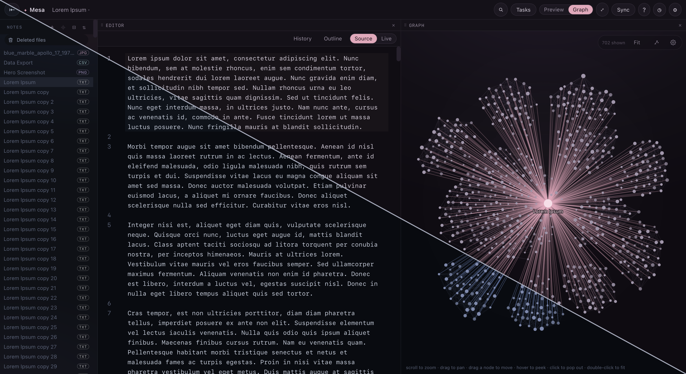

<p align="center">
  
</p>

<p align="center">
  <strong>Your documents, research, and tools in one local workspace.</strong><br />
  <a href="#features">Features</a>&nbsp;·&nbsp;<a href="#install">Install</a>&nbsp;·&nbsp;<a href="#demo">Demo</a>&nbsp;·&nbsp;<a href="#architecture">Architecture</a>&nbsp;·&nbsp;<a href="#security">Security</a>&nbsp;·&nbsp;<a href="#limitations">Limitations</a>
</p>

<p align="center">
  
  
  
</p>

<p align="center">
  
</p>

## Mesa in 30 seconds

Mesa brings notes, PDFs, saved pages, tasks and terminal work into one desktop
workspace. Open a folder, read documents beside their connections, and gather
sources without losing your place. Your files stay in a normal folder that you
can use with other editors.

It exists for work that spans several documents and tools. The living graph
provides context; flexible views keep useful material nearby; optional Pi
research proposes changes for review before Mesa applies them.

**Early development · macOS, Windows and Linux.** Signed end-user releases and
complete native platform acceptance are pending.

## Features

- **A living graph.** Explore links between your notes beside the document
  you're reading, with previews and visible file activity.
- **One flexible workspace.** Read documents, search indexed text and keep tasks
  or scratch work nearby. Dock views or drag them into native windows.
- **Research you can review.** Use the optional Pi terminal and browser to gather
  sources, then inspect proposed note changes before applying them through Mesa.
  [Deep Research](docs/deep-research.md) explains the workflow.

## Install

Use a development checkout until signed packages are available. The setup
wrappers install supported missing prerequisites and launch a local release build:

```bash
git clone https://github.com/xobash/xo-mesa.git
cd xo-mesa
bash run.sh
```

On Windows, run `run.cmd`. Native build tools can require system permission.
First builds take longer; later starts reuse an unchanged build. Local source
edits are included in that build.

| Development target | Runtime requirement |
| --- | --- |
| macOS, Apple Silicon or Intel | macOS 13.3+; WKWebView/Safari 16.4+ |
| Windows, x86-64 | Windows 10/11; Evergreen WebView2 111+ |
| Linux, x86-64 | GTK 3, WebKitGTK 4.1 and compatible distribution libraries |

See [platform setup](docs/cross-platform.md). These targets do not establish
completed clean-install acceptance. Future signed packages will be available
under [Releases](https://github.com/xobash/xo-mesa/releases) with
[verification instructions](docs/release.md).

<details>
<summary>Versioned source installation after the first signed release</summary>

### Versioned source bootstrap

For a published `v0.1.0` source release, these commands check the bootstrap's
reviewed SHA-256 before execution. The installer then verifies the signed
release tag using Git's configured release-signing trust and launches only that
version. Install the maintainer's verified public signing key before use;
signature failures stop setup. These commands require the published
signed release. Source setup installs supported missing build tools and
reuses an unchanged local release build on later starts.

macOS and Linux:

```bash
( set -e; p=$(mktemp); trap 'rm -f "$p"' EXIT; curl --proto '=https' --tlsv1.2 -fsSL https://raw.githubusercontent.com/xobash/xo-mesa/v0.1.0/install.sh -o "$p"; if command -v shasum >/dev/null; then printf '6c4a390912e85dea27ee55824f59f858a9a18c39115fc2bcb66302db5a6702cb  %s\n' "$p" | shasum -a 256 -c -; else printf '6c4a390912e85dea27ee55824f59f858a9a18c39115fc2bcb66302db5a6702cb  %s\n' "$p" | sha256sum -c -; fi; bash "$p" )
```

Windows 10 and Windows 11:

```powershell
& { $ErrorActionPreference = 'Stop'; $p = Join-Path ([IO.Path]::GetTempPath()) (([guid]::NewGuid().ToString('N')) + '.ps1'); try { Invoke-WebRequest https://raw.githubusercontent.com/xobash/xo-mesa/v0.1.0/install.ps1 -OutFile $p; if ((Get-FileHash $p -Algorithm SHA256).Hash -ne '3a5155311672978ecdc002392d9c328829b31a96c6c371378ae7ffa852146f78') { throw 'Mesa bootstrap checksum mismatch' }; Get-Content -Raw $p | Invoke-Expression } finally { Remove-Item $p -ErrorAction SilentlyContinue } }
```

The source installers preserve existing local files and refuse non-fast-forward
updates. Windows also preserves untracked source changes across an update and
stops before launch if restoring them conflicts. Source builds include local
source edits; use the signed packages for the reviewed release bytes.

</details>

## Demo

A 90-second native screen recording of a sample vault is being prepared.

## Architecture

**Tauri 2** hosts a **React and TypeScript** interface in the operating system's
webview. **Rust** handles native files, verified writes, sync, credentials and
the Pi terminal. Document engines load when needed.

Vault files are the source of truth. Local indexes and caches help search and
navigation; they are disposable, not backups. See
[document architecture](docs/document-architecture.md) and
[vault indexing](docs/vault-index.md).

## Security

Mesa has no telemetry integration or hosted account service. Optional Pi
providers, browsing, approved active HTML and device sync send data to their
configured destinations.

Folder approval, expected-byte/read-back save checks and sync key proof with
certificate pinning have regression coverage. Independent penetration testing,
coverage-guided fuzzing and complete native acceptance remain unverified.
Read the [security model](docs/security.md) and [vault safety](docs/vault-safety.md).

## Limitations

- Signed releases and installation/interaction acceptance across all three
  operating systems are pending.
- Device sync is experimental; physical multi-device acceptance is incomplete.
- Search, graph, backlinks and tasks can be incomplete during indexing. Automatic
  text reads skip files over 8 MiB until you load them explicitly.
- Unsaved Scratchpad and Whiteboard drafts stay in local app storage. Save them
  as vault documents for file-based retention and sync.
- Pi has normal process permissions. Its shell actions are outside Mesa's
  reviewed apply transaction.
- Recovery is not a backup. External writers and disk failures remain risks;
  Windows directory-metadata durability after power loss is unverified.

Start with backed-up or sample files. The next milestone is a signed alpha with
native workflow and device-sync acceptance; no release date is promised.

For manual development, install Node.js 20.19+, npm, Rust and native Tauri
prerequisites, then run `npm ci` and `npm run mesa`. See
[CONTRIBUTING.md](CONTRIBUTING.md) for checks and the
[MIT License](LICENSE) for terms.
