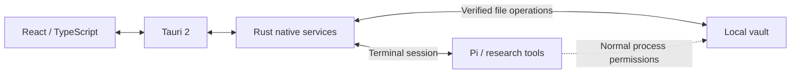

<p align="center">
  
</p>

<p align="center">
  <strong>Your documents, research, and tools in one local workspace.</strong>
</p>

<p align="center">
  
</p>

<p align="center">
  <a href="#why-mesa">Why Mesa?</a>&nbsp;·&nbsp;<a href="#features">Features</a>&nbsp;·&nbsp;<a href="#try-mesa">Try Mesa</a>&nbsp;·&nbsp;<a href="#demo">Demo</a>&nbsp;·&nbsp;<a href="#development">Development</a>&nbsp;·&nbsp;<a href="#architecture">Architecture</a>&nbsp;·&nbsp;<a href="#security">Security</a>&nbsp;·&nbsp;<a href="#limitations">Limitations</a>
</p>

<p align="center">
  
  
  
</p>

## Why Mesa?

Research work spreads across PDFs, notes, browser tabs, terminal sessions and
task lists. Mesa brings those materials into one local, file-based workspace
without requiring a hosted account. Read documents beside their connections,
gather sources and review proposed changes without losing your place.

Your files stay in a normal folder that you can use with other editors.

## Features

- **A living graph.** Explore links between your notes beside the document
  you're reading, with previews and visible file activity.
- **One flexible workspace.** Read documents, search indexed text and keep tasks
  or scratch work nearby. Dock views or drag them into native windows.
- **Research you can review.** Use the optional Pi terminal and browser to gather
  sources, then inspect proposed note changes before applying them through Mesa.
  [Deep Research](docs/deep-research.md) explains the workflow.

## Status

Mesa is in early development.

| Area | Status |
| --- | --- |
| Core local workspace | Available in development builds |
| Signed releases | Pending |
| Native cross-platform acceptance | Incomplete |
| Device sync | Experimental; physical multi-device acceptance incomplete |

## Try Mesa

Signed end-user installers are pending. See [verified installation](docs/release.md#release-verification) for the release requirements.

The following commands are **developer-only setup** from mutable source. Review
the checkout before running it; setup can install tools and request system permission.
Use sample files or a backup. Install Git first; the setup wrapper handles
supported missing build tools. First builds can take several minutes and may
need system permission. Later starts reuse an unchanged build.

### Windows — PowerShell

```powershell
git clone https://github.com/xobash/xo-mesa.git; if ($LASTEXITCODE -eq 0) { Set-Location xo-mesa; .\run.cmd }
```

### macOS / Linux — Terminal

```bash
git clone https://github.com/xobash/xo-mesa.git && cd xo-mesa && bash ./run.sh
```

Already cloned? From the repository folder, run `.\run.cmd` in Windows
PowerShell or `bash ./run.sh` on macOS/Linux. Local source edits are included in
the build.

For OS requirements and troubleshooting, see [platform setup](docs/cross-platform.md).
**Verified releases:** See [Release Verification](docs/release.md#release-verification),
including the versioned one-command installers. These require the first signed
release, which is still pending.

## Demo

Explore a sample vault in Darkroom: navigate notes, search their contents, and
expand the living graph.


## Development

To work on Mesa, install Node.js 20.19+, npm, Rust and the
[native platform prerequisites](docs/cross-platform.md). From the checkout:

```bash
npm ci
npm run mesa
```

`npm run dev` starts the browser demo. For tests, builds and contribution guidance,
see [CONTRIBUTING.md](CONTRIBUTING.md).

## Architecture

React and TypeScript provide the interface. Tauri 2 hosts it in the operating
system's webview; Rust handles native files, verified writes, sync and the Pi
terminal.


```mermaid
flowchart LR
  UI["React / TypeScript"] <--> Tauri["Tauri 2"]
  Tauri <--> Rust["Rust native services"]
  Rust <-->|"Verified file operations"| Vault["Local vault"]
  Rust <-->|"Terminal session"| Pi["Pi / research tools"]
  Pi -.->|"Normal process permissions"| Vault
```

Vault files are the source of truth. Indexes and caches are disposable, not
backups. See [document architecture](docs/document-architecture.md) for details.

## Security

Mesa has no telemetry integration or hosted account service. Optional Pi
providers, browsing, approved HTML online resources and device sync contact
their configured destinations.

Folder approval, verified saves and sync certificate checks have regression
coverage. Independent penetration testing, complete native acceptance and broad
fuzzing remain unverified. Read the [security model](docs/security.md) and
[vault safety](docs/vault-safety.md).

## Limitations

- Search, graph, backlinks and tasks can be incomplete during indexing. Automatic
  text reads skip files over 8 MiB until you load them explicitly.
- Unsaved Scratchpad and Whiteboard drafts stay in local app storage. Save them
  as vault documents for file-based retention and sync.
- Pi has normal process permissions. Its shell actions are outside Mesa's
  reviewed apply transaction.
- Recovery is not a backup. External writers and disk failures remain risks;
  Windows directory-metadata durability after power loss is unverified.

Mesa is [MIT licensed](LICENSE). No release date is promised.
